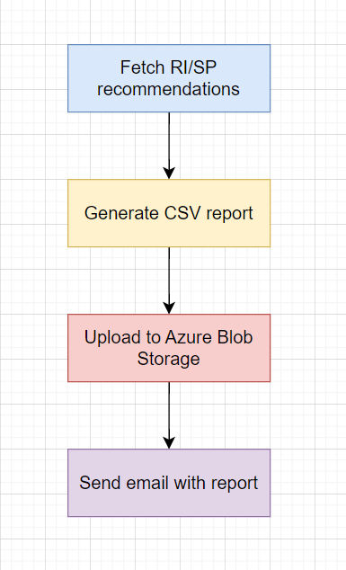

# Azure RI/SP Optimizer

This project implements an Azure Function App that automatically fetches Reserved Instance (RI) and Savings Plan (SP) recommendations from Azure Cost Management, stores the results as a CSV file in Azure Blob Storage, and optionally sends an email notification with the report using SendGrid.

It supports scheduled weekly/monthly execution and is designed to help teams optimize cloud costs by analyzing usage patterns and identifying potential savings.

---

## Features

* Fetches RI/SP recommendations from Azure Cost Management API
* Authenticates using a Service Principal (Client Secret)
* Exports recommendations to a CSV file
* Uploads results to Azure Blob Storage
* Sends email notifications via SendGrid
* Supports both local development and deployment via Azure Functions
* Modular scripts for usage analysis, email notification, and token management
* Fully automated timer-triggered pipeline (`UploadRIRecommendations/__init__.py`)

---

## Project Structure

```
azure-ri-sp-optimizer/
├── .vscode/                          # VS Code settings
├── ri_function_project/             # Azure Function App project
│   ├── .vscode/                     # VS Code settings for project
│   ├── UploadRIRecommendations/     # Main Function folder for automation
│   │   ├── __init__.py              # Timer trigger: fetch + generate CSV + upload + email
│   │   └── function.json            # Function bindings (schedule: every Monday 8AM UTC)
│   ├── __init__.py                  # Initializes the function app
│   ├── analyze_ri_usage.py         # Analyzes usage data for cost-saving opportunities
│   ├── fetch_ri_recommendations.py # (Now part of automated function) Fetch RI/SP data
│   ├── fetch_ri_usage_data.py      # Fetches actual RI usage data over last 30 days
│   ├── function_app.py             # Main FunctionApp object
│   ├── get_access_token.py         # Helper to fetch Azure AD access token (used in local dev)
│   ├── host.json                   # Azure Function host config
│   ├── requirements.txt            # Azure SDK dependencies
│   ├── send_email.py               # Handles SendGrid email delivery
│   ├── .funcignore                 # Files ignored during function deploy
│   ├── .gitignore                  # Excludes secrets and build artifacts
│   ├── ri_recommendations.csv      # Sample generated CSV (optional)
│   ├── ri_recommendations.json     # Sample JSON (optional)
│   └── README.md                   # Project documentation
├── .gitignore                       # Root-level ignore settings
├── requirements.txt                # Root-level package requirements
├── Flowchart.PNG                   # Flowchart image showing pipeline
├── README.md                       # Root-level README (this file)
```

---
## Pipeline Flowchart

The following diagram illustrates the automated flow of the Azure Function:



---

## Functionality Overview

### 1. **Authentication**

The app supports two modes of authentication:

* **Production:** via `Environment Variables` for client secret, tenant ID, and subscription ID.
* **Local Development:** via `sp_credentials.json` file.

This is handled inside the function automatically.

### 2. **Fetch + CSV Generation + Upload + Email**

The complete workflow is encapsulated in `UploadRIRecommendations/__init__.py`:

* Obtains Azure AD token via client credentials
* Sends a GET request to the RI/SP API endpoint
* Parses results into a CSV string (saved in memory)
* Uploads the in-memory CSV to the `ri-reports` Blob container
* Sends the same CSV file as an email attachment using **SendGrid**

### 3. **CSV Output Structure**

The generated CSV includes:

* Subscription ID
* Resource Type
* Region
* Term
* Scope
* Recommended Quantity
* On-Demand Cost (Monthly)
* RI/SP Cost (Monthly)
* Estimated Savings (Monthly)
* Estimated Savings (%)
* Usage Patterns Analyzed
* Confidence Rating
* Offer ID
* Effective Date
* Recommendation Type

---

## Deployment

### Requirements

* Python 3.10+
* Azure Functions Core Tools
* Azure CLI
* VS Code with Azure Functions extension

### Installation

```bash
python3.10 -m venv .venv
source .venv/bin/activate
pip install -r requirements.txt
```

### Required Environment Variables

Add these in **Azure Portal > Function App > Configuration** or in `local.settings.json` for local testing:

```json
{
  "IsEncrypted": false,
  "Values": {
    "AzureWebJobsStorage": "<your-storage-conn-string>",
    "FUNCTIONS_WORKER_RUNTIME": "python",

    "TENANT_ID": "<your-tenant-id>",
    "CLIENT_ID": "<your-client-id>",
    "CLIENT_SECRET": "<your-client-secret>",
    "SUBSCRIPTION_ID": "<your-subscription-id>",

    "SENDGRID_API_KEY": "<your-sendgrid-api-key>",
    "ADMIN_EMAIL": "<recipient-email@example.com>"
  }
}
```

### Deploy to Azure
 
> **Important**: Ensure you open the `ri_function_project/` folder in VS Code before deploying.

1. In VS Code, open the Command Palette (`Ctrl+Shift+P`) and select:

   ```
   Azure Functions: Deploy to Function App
   ```
2. Select your Azure subscription
3. Choose an existing Function App or create a new one
4. Wait for deployment to complete
5. Go to **Azure Portal > Function App** to view the deployed function
6. Under **Functions**, confirm `UploadRIRecommendations` appears with a timer trigger
7. Test manually using `Run` from the Azure Portal if needed

### Create Blob Container

* Go to your Azure Storage Account
* Under **Containers**, create a new container named:

```
ri-reports
```

* Ensure it has **private** access level

### Run Locally

```bash
func start
```

Make sure `local.settings.json` is populated with credentials (or use `sp_credentials.json` as fallback).

---

## Timer Trigger Schedule

This Azure Function is triggered every **Monday at 8:00 AM UTC** via the following CRON expression:

```json
"schedule": "0 0 8 * * 1"
```

This can be modified in the `function.json` file inside `UploadRIRecommendations`.

After each run, you can:
- Visit the **Blob Storage container** to confirm the `.csv` file was uploaded
- Check your **email inbox** for the automated report

---

## Acknowledgments

Developed as part of a cost optimization project for managing Reserved Instances and Savings Plans in Microsoft Azure.

